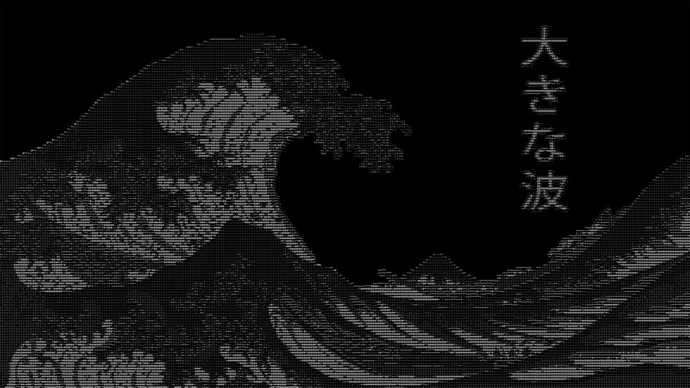
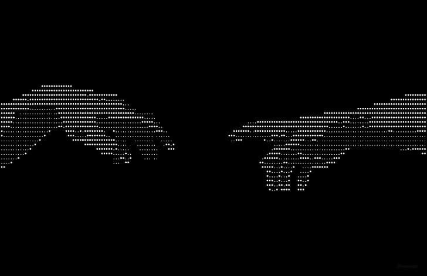

  

 

<h1 align="center">Ferenc Burian</h1>

  <code>AI / ML Engineer_</code>

  <i>building quiet systems with loud consequences.</i>

 

---

### ◆ About

<table>
<tr>
<td width="62%" valign="middle">

I build **AI systems** end to end — from data pipelines to production agents.
Currently focused on **LLMs**, **agent workflows**, and **clean ML infrastructure**.

- ▸ **Main focus:** LLM applications & autonomous agent systems
- ▸ **Technical interests:** Retrieval, evals, agent orchestration, ML infra
- ▸ **Data:** Warehousing, pipelines, analytics on Google Cloud
- ▸ **Beyond code:** clarity over cleverness — systems that survive contact with reality.

</td>
<td width="38%" align="center" valign="middle">
  
</td>
</tr>
</table>

 

---

### ◆ Tech Stack

**◇ AI / ML**

**◇ Web**

**◇ Data & Cloud**

 

---

### ◆ Collaboration Stats

 
 

 
 

 

---

### ◆ Contact

 
 

  

 

  <code>静寂 · silence_</code>

  "small force, applied long, moves mountains."

